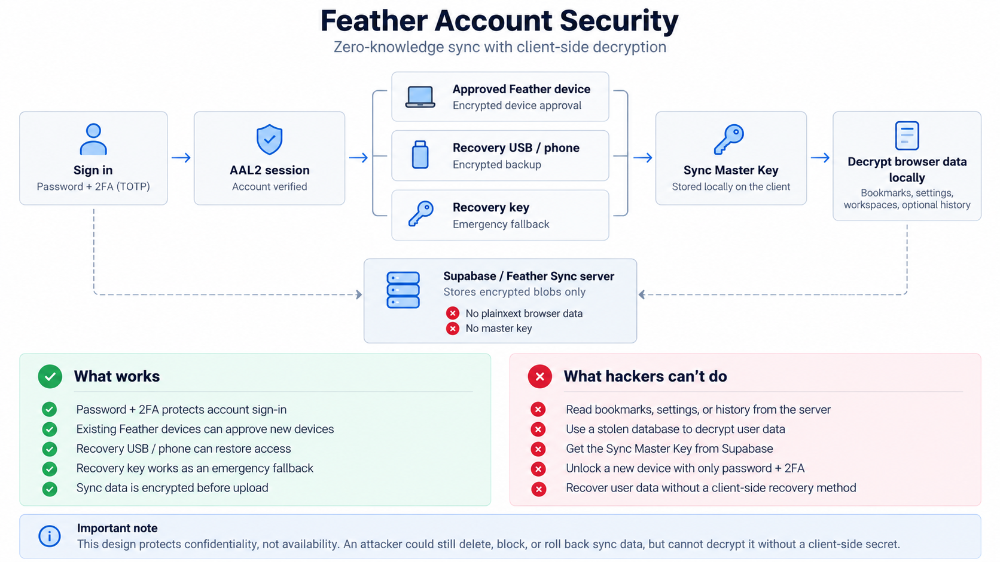

# Feather Account Security

Feather Account Sync is designed around a simple rule:

> **Your synced browser data should only be decryptable by your Feather clients.**

The Feather Sync service and Supabase are used for authentication, authorization, encrypted storage, and device coordination. They do **not** receive the Sync Master Key required to decrypt your browser data.

<p align="center">
  
</p>

## Security model

Feather separates **account authentication** from **data encryption**.

Signing in proves that you own the account. It does not automatically provide access to encrypted browser data on a new device.

```text
Password + 2FA
      │
      ▼
Account verified
      │
      ├── Existing Feather device approval
      ├── Recovery USB / phone
      └── Recovery key
                 │
                 ▼
          Sync Master Key
                 │
                 ▼
       Browser data decrypted
             locally
```

This prevents a successful Feather/Supabase login from becoming a decryption key.

## What Feather encrypts

Before supported sync data leaves the client, Feather encrypts it locally.

Feather Sync currently protects:

- Bookmarks
- Browser settings
- Workspaces
- Quick links
- Shield configuration
- Optional browsing history
- Optional session/open-tab data

The server receives an encrypted blob instead of individual plaintext browser records.

Feather does **not** currently treat the following as normal sync data:

- Website passwords
- Cookies
- Authentication cookies
- Payment information
- Downloaded files
- Favicons

Passwords and cookies require a separately reviewed vault design before they should ever be synced.

## Sync Master Key

Each Feather sync account uses a randomly generated **256-bit Sync Master Key**.

The key is generated on the client using the operating system cryptographic random number generator.

The Sync Master Key is used to protect browser sync data with:

- **AES-256-GCM** authenticated encryption
- **HKDF-SHA256** for key separation

The plaintext Sync Master Key is never uploaded to Supabase.

On an authorized Windows device, Feather protects the local copy of the key using Windows DPAPI with `CurrentUser` scope.

## Account authentication

Feather accounts can use:

- Account password
- TOTP two-factor authentication
- Supabase AAL2 sessions for sensitive operations

TOTP protects the account, but a six-digit TOTP code is **not** an encryption key.

A successful password + 2FA login proves account ownership, but a new device still needs a client-side method to obtain the Sync Master Key.

## New-device approval

An existing authorized Feather device can approve a new Feather installation without exposing the Sync Master Key to the server.

Each installation creates its own device key pair.

Device approval uses:

- P-256 ECDH
- HKDF-SHA256
- AES-256-GCM

The flow is:

1. The new device signs in and completes 2FA.
2. The new device creates a local ECDH private/public key pair.
3. Only its public key is sent to the server.
4. Feather shows a pairing fingerprint on the new device.
5. An existing authorized device shows the same pending-device fingerprint.
6. The user verifies the fingerprints match.
7. The existing device derives a shared secret with the new device.
8. The Sync Master Key is encrypted specifically for that device.
9. Supabase relays only the encrypted transfer.
10. The new device decrypts the transfer locally.
11. The new device verifies the current encrypted sync data.
12. The Sync Master Key is stored locally using DPAPI.
13. The one-time transfer is removed.

A normal new-device login therefore does **not** require the recovery key when another authorized device is available.

## Pairing fingerprint

Feather displays a short fingerprint derived from the new device public key, for example:

```text
91C4-06AF-720E-95B1
```

The fingerprint must match on both devices before approval.

This is a security check, not a cosmetic identifier. It helps detect public-key substitution during device pairing.

## Recovery

Feather also supports an emergency recovery path.

A random recovery secret is shown when encrypted sync is first created. The user can either store the key manually or save an encrypted `.feather-recovery` backup file to local or removable storage.

Recovery backup files use:

- PBKDF2-HMAC-SHA256 with 600,000 iterations
- A random 256-bit salt
- AES-256-GCM authenticated encryption
- A separate backup password of at least 12 characters

The raw recovery key is not written to the backup file. The recovery-backup password should remain separate from the Feather account password. A `.feather-recovery` file can be placed on a USB drive or other storage that Windows exposes through the standard file picker.

### Why recovery is separate

A Feather/Supabase password reset restores access to the **account**.

It does not restore the ability to decrypt existing sync data.

If a user loses:

- every authorized Feather device, and
- every recovery method,

their encrypted sync data may become permanently unrecoverable.

That is an intentional property of a system where the service operator does not possess a decryption path.

## What the Feather Sync server stores

The server may store information such as:

- Account UUID
- Account authentication metadata
- MFA factor metadata
- Device UUIDs
- Device names
- Device public keys
- Encrypted Sync Master Key transfer envelopes
- Encrypted recovery/key bundles
- Encrypted browser sync blobs
- Sync revision numbers
- Update timestamps
- Ciphertext sizes

Infrastructure providers may also retain normal network and service logs.

## What the server does not receive

The Feather Sync service should never receive:

- Plaintext bookmarks
- Plaintext browsing history
- Plaintext browser settings
- Plaintext synced sessions
- The plaintext Sync Master Key
- Device private keys
- The user's random recovery secret
- Decrypted browser sync blobs

Even someone with database administrator access should only see ciphertext for protected browser contents.

## If the database is stolen

A database leak may expose:

```text
User UUID
Device metadata
Encrypted key bundles
Encrypted browser blobs
Timestamps
Ciphertext sizes
```

It should not expose:

```text
Bookmarks
History
Settings
Workspaces
Open tabs
Sync Master Key
Recovery secret
```

Possession of the database alone is not sufficient to decrypt the protected browser contents.

## What an attacker still can do

Zero-knowledge encryption protects **confidentiality**. It does not make the server trusted for availability.

A malicious or compromised sync service could potentially:

- Delete encrypted sync data
- Refuse sync requests
- Corrupt encrypted data
- Block device approval
- Replay an older valid encrypted snapshot
- Remove device metadata
- Prevent account access

Feather uses authenticated encryption, revision checks, and local key-bundle fingerprint pinning to detect several forms of tampering.

However, no client-side encryption scheme can force an untrusted server to remain available.

## Rollback protection

Authorized devices remember the highest sync revision they have already accepted.

If the server later returns an older revision, Feather can reject it as a possible rollback.

A completely fresh device cannot independently prove that the server has never replayed an older but otherwise valid encrypted state. Stronger protection against that class of attack would require an additional transparency or trusted-device protocol.

## Compromised client devices

Feather's sync encryption cannot protect data from malware that already controls an unlocked client.

If malicious software can run as the same Windows user while Feather is unlocked, it may be able to access decrypted data or intercept it before encryption.

Likewise, a deliberately malicious Feather build could exfiltrate keys.

For this reason the project should also rely on:

- Signed releases
- Protected release credentials
- Dependency review
- Public source code for the sync implementation
- Reproducible builds where practical
- Security review of cryptographic changes
- No remote code in key-management paths

## Important security properties

### Password + 2FA protects account access

A stolen password by itself should not be enough to perform sensitive Feather Sync operations when MFA is enabled.

### 2FA alone does not decrypt sync data

A six-digit TOTP code is an authentication factor, not encryption material.

Feather does not derive the Sync Master Key from TOTP.

### Supabase does not hold the Sync Master Key

Supabase stores encrypted data and encrypted transfer envelopes.

It should never receive the plaintext master key.

### Existing devices can authorize new devices

An approved Feather device can securely transfer the Sync Master Key to another client using device-to-device cryptography.

### Recovery is client-controlled

Recovery secrets remain under the user's control rather than under the Feather service operator's control.

## Security goals

Feather's account system aims to provide:

- End-to-end encrypted browser sync
- Client-side key generation
- Client-side decryption
- Multi-factor account authentication
- Secure device approval
- Manual recovery keys and encrypted recovery-backup files
- Minimal server trust
- No operator-accessible plaintext browser sync data

## Non-goals

This model does not attempt to:

- Hide all account metadata from Supabase
- Prevent traffic analysis
- Guarantee sync availability
- Protect an already-compromised client
- Recover data after all client-side secrets have been lost
- Make TOTP itself into an encryption key

## Reporting security issues

Please do not open public GitHub issues for vulnerabilities that could put users at risk.

Use the security-reporting process described in [`SECURITY.md`](SECURITY.md).

---

**Summary:** Feather accounts authenticate through the service, but browser data is encrypted and decrypted on Feather clients. The server stores ciphertext and metadata, while the secrets required to decrypt synced browser contents remain on user-controlled devices or recovery media.
